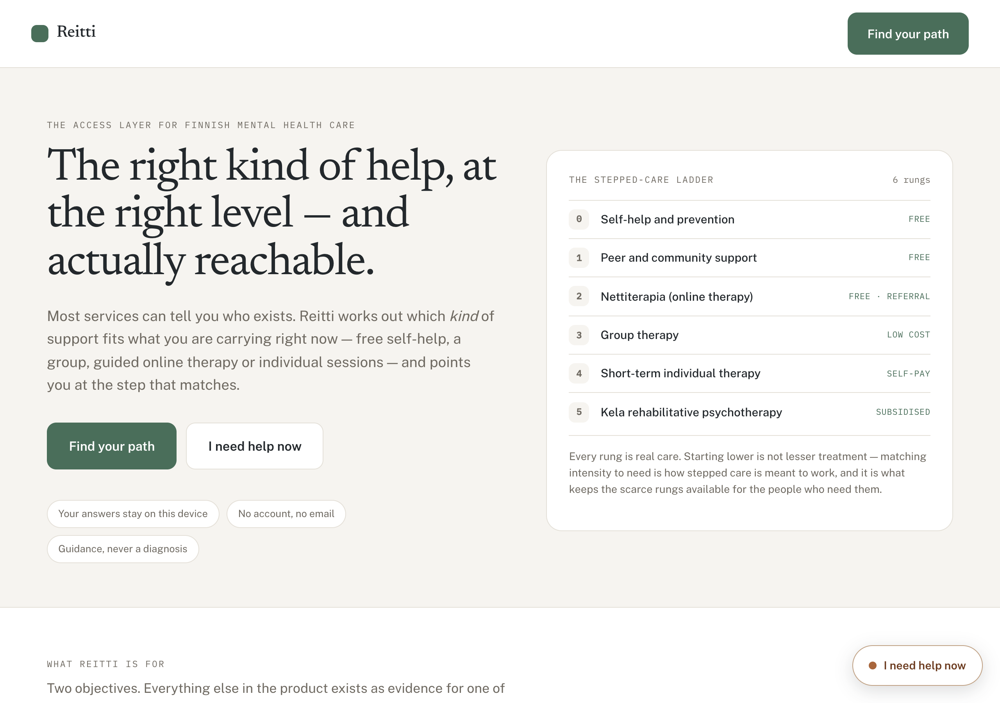
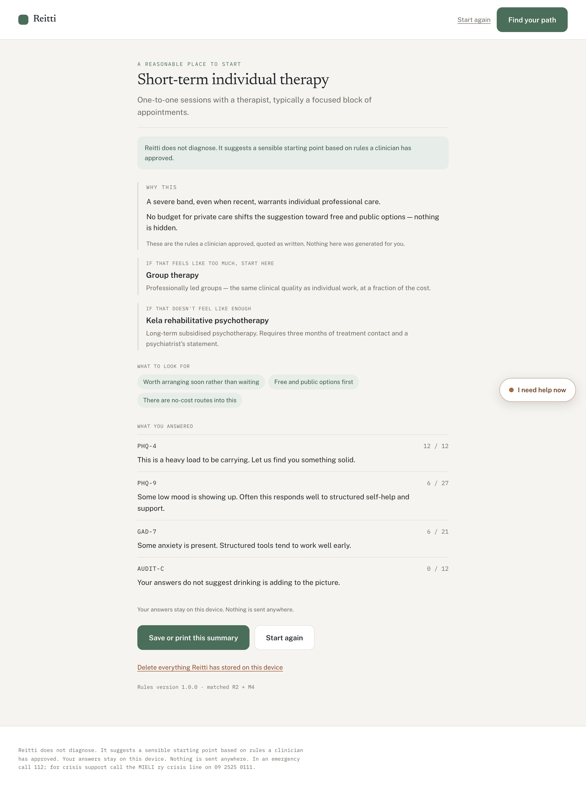
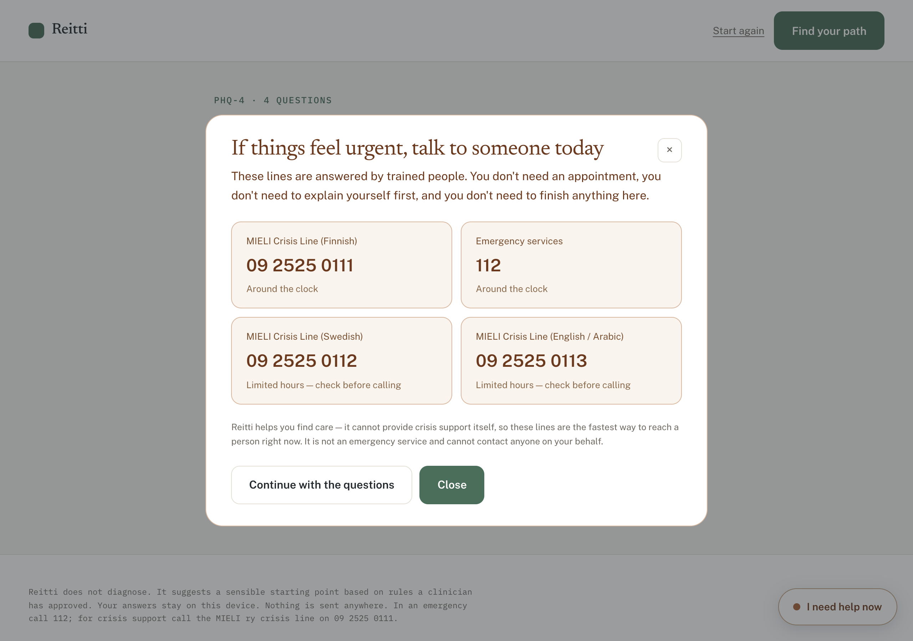
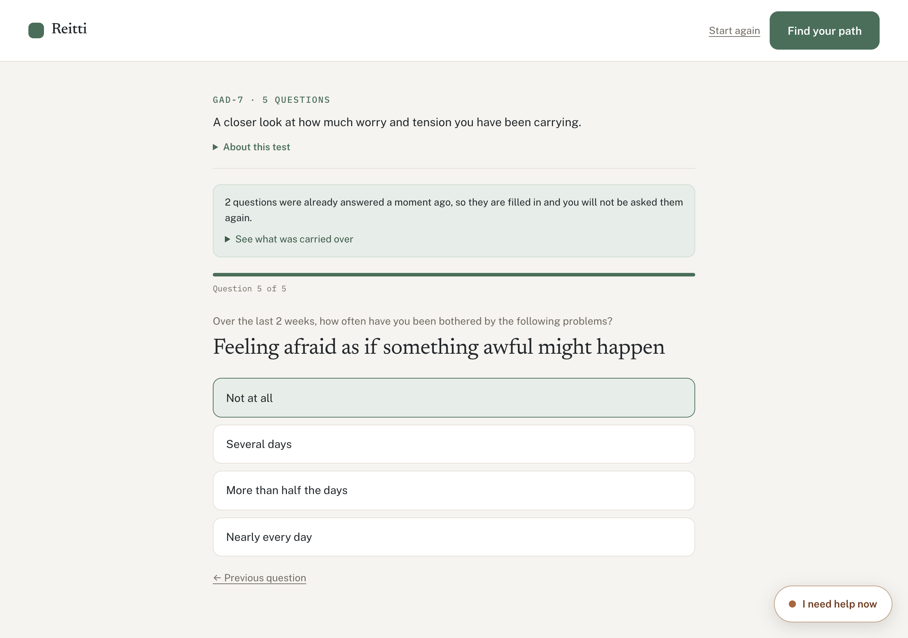

# Reitti

**Not sure what kind of mental-health support you need? Reitti helps you find a reasonable place to start.**

No account · Nothing leaves your device · About two minutes

<p align="center">
  
</p>

---

## The problem

Finland does not have a shortage of *directories*. It has a shortage of **navigation**.

Someone who is struggling can already find a list of therapists. What they cannot find out is
which *kind* of support fits what they are carrying, whether it is reachable on their budget and
in their language, and who is actually taking clients this month. So the first move is usually to
email therapists one at a time and wait.

Reitti sits between "I don't know what kind of help I need" and "here is the appropriate level of
care I can realistically get":

```
experience  →  validated signals  →  a band  →  a rung of the ladder  →  reachable options
```

It never returns a diagnosis. It returns a **band**, a **reflection**, and a **suggested starting
point**, with the rungs either side of it offered as "if that feels like too much / not enough."

## The two values

Every decision in this repo serves one of these. If it doesn't, it's out.

1. **The right session.** A non-diagnostic assessment routes each person to the *right kind* of
   care — a session, a group, a workshop, self-help, or nettiterapia — not just any open slot.
2. **Reachable for anyone.** A stepped-care ladder, groups, demand pooling and free public services
   make appropriate help reachable at every budget — including capacity that does not exist yet.

## The stepped-care ladder

```
self-help → peer/community → nettiterapia → group therapy → short-term individual → Kela
```

The product's central idea is that **starting lower is not lesser treatment**. A recommendation of
self-help is not a verdict that your problem is small; it is where the evidence says to begin, and
it is what keeps the scarce rungs available for the people who need them.

---

## How the routing actually works

The engine is a pure function. Clinical logic lives in `config/`, never in code — adding an
instrument or changing a cutoff is a JSON change, not a deploy of new logic.

```
                    config/                              packages/engine/          apps/web/
  ┌───────────────────────────────────────┐        ┌────────────────────────┐   ┌──────────────┐
  │ instruments/   one JSON per screener  │───────▶│ scoreInstrument()      │──▶│              │
  │   PHQ-4 · PHQ-9 · GAD-7 · AUDIT-C     │        │   answers → band       │   │  one         │
  │   PC-PTSD-5 · UCLA-3 · WHO-5          │        │   + severity + flags   │   │  questionnaire│
  ├───────────────────────────────────────┤        ├────────────────────────┤   │  component   │
  │ routing/flow.json   who sees what     │───────▶│ nextInstrumentId()     │──▶│  for every   │
  ├───────────────────────────────────────┤        ├────────────────────────┤   │  instrument  │
  │ routing/rules.json  if → then + why   │───────▶│ route()                │──▶│              │
  │ ladder/ladder.json  the six rungs     │        │   → rung + reasons     │   │              │
  ├───────────────────────────────────────┤        ├────────────────────────┤   ├──────────────┤
  │ crisis.json         invariants 1–3    │───────▶│ checkCrisis()          │──▶│ crisis panel │
  │ i18n/en.json        all clinical copy │        │   on every answer      │   │ (no AI)      │
  └───────────────────────────────────────┘        └────────────────────────┘   └──────────────┘
                                                     pure · no I/O · no clock
```

A routing rule is one readable line plus the reason a clinician signed off:

```jsonc
{
  "id": "R5",
  "because": "A moderate band is the evidence-based home of nettiterapia and professional groups.",
  "when": { "severityAtLeast": 2 },
  "then": { "rung": "nettiterapia", "tags": ["structured"] }
}
```

That `because` string is not only for the clinician. **It is what the person reads on their
result**, under "Why this" — one string, so the explanation can never drift from the rule that
actually fired.

<p align="center">
  
</p>

Run `npm run rules:print` to render the whole decision surface as a page a clinician can read,
mark up and sign.

---

## Safety invariants

Six rules that are never traded away for a feature. They are executable — `packages/engine/test/invariants.test.ts`
and `tests/a11y/crisis-path.spec.ts`. **If one fails, the failure is correct and the feature is wrong.**

| # | Invariant |
|---|-----------|
| 1 | The crisis control is reachable from **every** screen — no sign-up, no completed test |
| 2 | A crisis-flagged answer (PHQ-9 item 9) triggers the crisis panel **before scoring continues** |
| 3 | The crisis panel shows real 24/7 Finnish resources (MIELI ry by language; 112) — never a chatbot, never AI |
| 4 | No screen ever shows a disorder label. Output is band + reflection + suggested rung |
| 5 | The AI layer can never override crisis routing, emit a diagnosis, or reorder clinical matches |
| 6 | Paid placement never reorders clinical recommendations |

<p align="center">
  
</p>

The crisis path deliberately does not use the brand green. It must not read as one more product
feature.

## Privacy model

The claim is narrow and literal, which is what makes it keepable:

- **No client accounts.** There is no client login anywhere in the codebase. Login exists only for
  *providers*, and only from V2.
- **Answers stay on the device.** `apps/web/src/store.ts` uses `localStorage` and may never gain a
  network call.
- **A half-finished assessment lives in `sessionStorage`**, not `localStorage` — it survives an
  accidental refresh but dies with the tab, because a partial set of symptom answers should not
  outlive the session on a shared or family device.
- **No fonts, scripts or assets from a CDN.** A font request that leaks an IP on every page load
  would undercut the whole claim. Fonts are self-hosted via `@fontsource`.
- **No session recording, heatmaps or behavioural analytics** — ever. A replay tool reconstructs
  exactly the thing we promised not to collect.
- **The client is always free.** No client payment path exists in the codebase. Revenue is provider
  SaaS, occupational-health B2B and public contracts.

## On AI

`packages/ai` is **an empty slot in V1**, and the app must work identically when it is absent. A
test enforces that it cannot import `packages/engine`.

The deterministic core is the source of truth and stays that way permanently. When the AI layer is
built its only permitted jobs are `understand-free-text`, `explain-result` and
`draft-referral-request` — never diagnose, route, override crisis, or reorder matches. It runs in
shadow mode first, and no model is trained until V3. Full contract: [`packages/ai/README.md`](packages/ai/README.md).

---

## Getting started

```bash
npm install
npm run dev            # http://localhost:5173
```

| Command | What it does |
|---|---|
| `npm test` | Engine, scoring, routing and the safety invariants (163 tests, no browser) |
| `npm run typecheck` | `tsc --build` across every workspace |
| `npm run test:a11y:setup` | Once — downloads the browsers Playwright drives |
| `npm run test:a11y` | axe-core, the crisis path, focus, announcements and WCAG reflow, in a real browser |
| `npm run test:a11y:report` | Open the HTML report |
| `npm run rules:print` | The routing table, formatted for clinician sign-off |
| `npm run build` | Production build of the web app |

Both suites run in CI on every push and pull request
([`engine`](.github/workflows/test.yml), [`accessibility`](.github/workflows/a11y.yml)).

## Repo layout

```
config/               THE governance surface — the clinician's editable layer
  instruments/        one JSON per instrument (Type 1 routing · 2 progress · 3 explore)
  routing/            rules.json (printable if→then table) + flow.json (the tiered funnel)
  ladder/             the stepped-care spine
  i18n/               all clinical wording, by ref
  crisis.json         invariants 1–3
packages/engine/      pure, framework-free, fully tested. No I/O, no clock, no React
packages/ai/          the isolated, assistance-only AI slot. Empty in V1
apps/web/             mobile-first React app
services/share-code/  (not built yet) expiring, encrypted, consent-only
docs/                 architecture, test catalog, phase plans
tests/a11y/           the browser gate: axe + crisis path + interaction + WCAG
```

## Testing

Two gates, deliberately separate — the engine is pure and should never need a browser.

**`npm test`** — 163 tests. Published cutoffs reproduced exactly, band tables with no gaps, every
i18n ref resolving, licensing enforced (`license: "verify-commercial"` fails on purpose), no
diagnostic label in any result-facing string, and the six safety invariants.

**`npm run test:a11y`** — 27 tests across four browser projects: desktop, OS high-contrast
(`forced-colors`), Android, and **WebKit** for iOS Safari. axe-core on every reachable screen, plus
the things a DOM scan cannot judge: focus containment in the crisis dialog, screen-reader
announcement when the question changes, the progress bar agreeing with the value it announces,
reflow at 320 CSS px, WCAG text-spacing overrides, `prefers-reduced-motion`, refresh durability,
and that no question is ever asked twice.

Green here means no *mechanical* failure. It is not a claim that a screen is usable by someone in
distress — that needs a moderated session and a clinician's read. See [`tests/a11y/README.md`](tests/a11y/README.md).

## Instruments

Seven, all validated and free or public domain. Nobody sees all of them: PHQ-4 runs for everyone
and the deeper screeners open only when the quick screen or the stated domain points to them.

| | Measures | Items | Signal |
|---|---|---|---|
| **PHQ-4** | The universal quick screen | 4 | The front door; its subscales open PHQ-9 and GAD-7 |
| **PHQ-9** | Depression severity | 9 | Band → rung. **Item 9 is the crisis trigger** |
| **GAD-7** | Anxiety severity | 7 | Band → rung for the anxiety domain |
| **AUDIT-C** | Alcohol use risk | 3 | Adds substance-aware resources; never a rung by itself |
| **PC-PTSD-5** | Trauma screen | 5 | Adds a trauma-informed tag |
| **UCLA-3** | Loneliness | 3 | Supplies the `social` domain tag that prefers a **group** |
| **WHO-5** | Wellbeing (Type 2) | 5 | The progress tracker; not in the funnel |

Because brief screeners are built by reusing items from longer ones — PHQ-4 *is* the first two
items of PHQ-9 and of GAD-7 — items declare a `concept`, and an answer is carried forward rather
than asked twice. Only when the concept, the recall window and the response scale all match
exactly, and **never** for a crisis item. What was reused is shown, and can be refused.

<p align="center">
  
</p>

Full detail — purpose, science, licensing, routing signal — in
[`docs/reitti-test-catalog.md`](docs/reitti-test-catalog.md).

---

## Status

**V1, in progress.** Built: the engine, the config surface, the Type-1 flow, the crisis path, the
on-device store, answer carry-forward, the printable summary and the marketplace previews. No AI
and no client login, by design.

Not yet built: the share-code service, `config/options/` (real reachable services per rung), Type-2
tracking, the therapist directory, and FI/SV translations.

> **Clinical content is provisional** until the clinician co-founder signs off. Band thresholds,
> which deep-dive fires at what level, and the reflection copy are all open — see "Open items
> before production" in the test catalog.

**On translations:** `config/i18n/fi.json` and `sv.json` are deliberately absent. A hand-translated
screening item measures something different, so they stay missing until the *official validated*
translations are obtained. English-only is the honest state, not a gap papered over. The language
question in the app is about **the care you are pointed to**, not the language of the page.

## Roadmap

| | |
|---|---|
| **Now** | Make the core journey excellent; `config/options/` so a result names services you can actually reach today |
| **V2** | Therapist directory with Valvira verification and live availability · groups with waitlists and **demand pooling** · share-code service · AI in shadow mode only |
| **V3** | Consented, opt-in, EU, identity-stripped outcomes; measurement-based care; the first trained models |

Sequenced in [`docs/reitti-new-phase-plan.md`](docs/reitti-new-phase-plan.md), which marks what is
shipped and what is not.

## Documentation

| Document | What it holds |
|---|---|
| [`docs/reitti-master-plan.md`](docs/reitti-master-plan.md) | The index and the workstreams |
| [`docs/reitti-architecture-v2.md`](docs/reitti-architecture-v2.md) | Full technical architecture, the AI path, phases |
| [`docs/reitti-test-catalog.md`](docs/reitti-test-catalog.md) | Every instrument: purpose, science, licensing, routing signal |
| [`docs/reitti-new-phase-plan.md`](docs/reitti-new-phase-plan.md) | The plan for the second version, with shipped/unshipped status |
| [`packages/ai/README.md`](packages/ai/README.md) | The AI layer contract |
| [`CLAUDE.md`](CLAUDE.md) | The rules that matter when writing code here |

## Tech

TypeScript 5.6 · React 18 · Vite 6 · npm workspaces · Vitest 2 · Playwright 1.62 with axe-core.
No UI framework, no CSS-in-JS, no CDN. The design system is one stylesheet and three self-hosted
typefaces.
